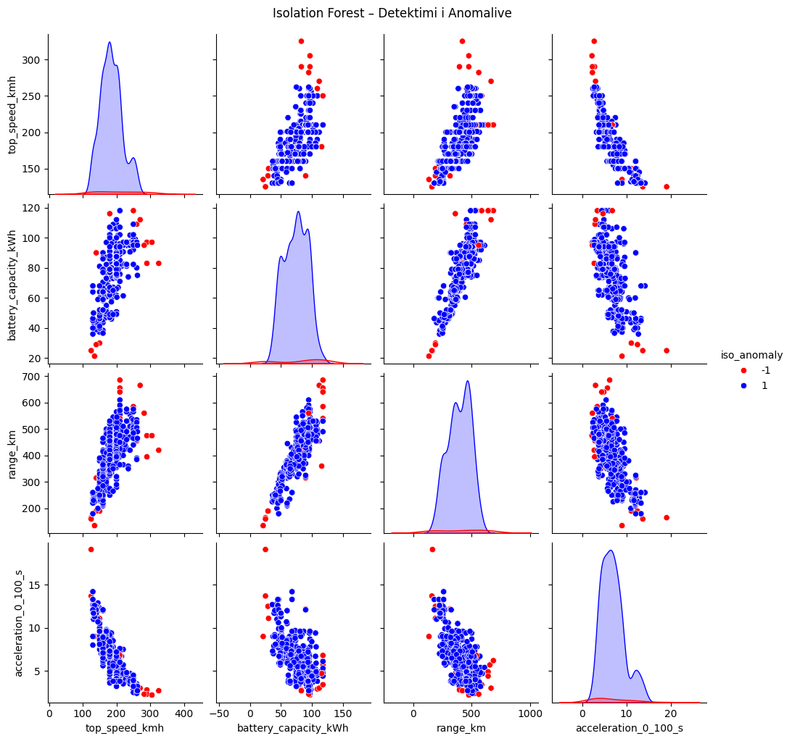
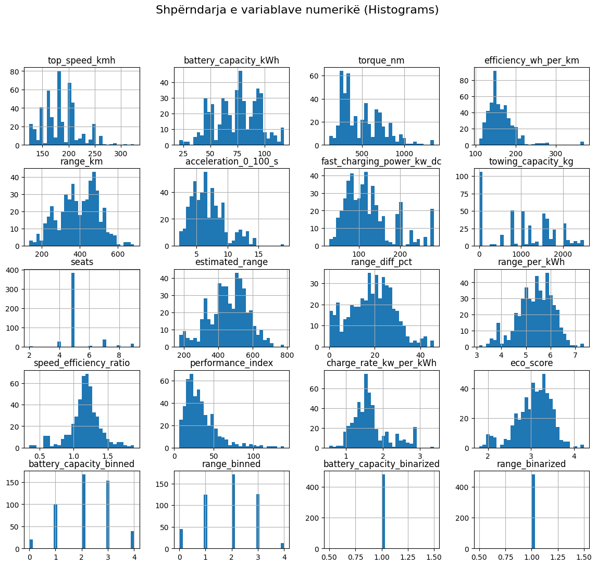
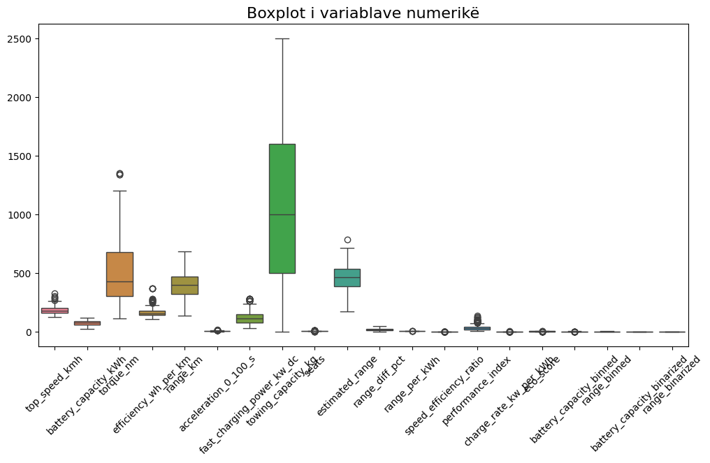
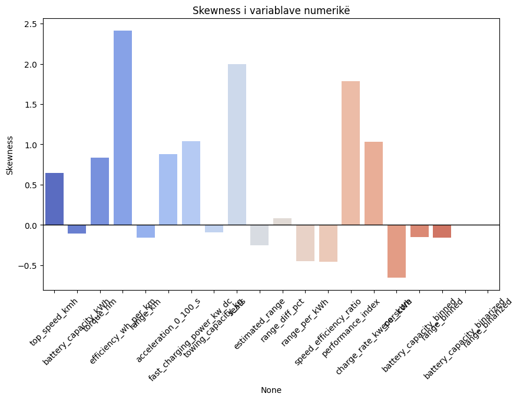
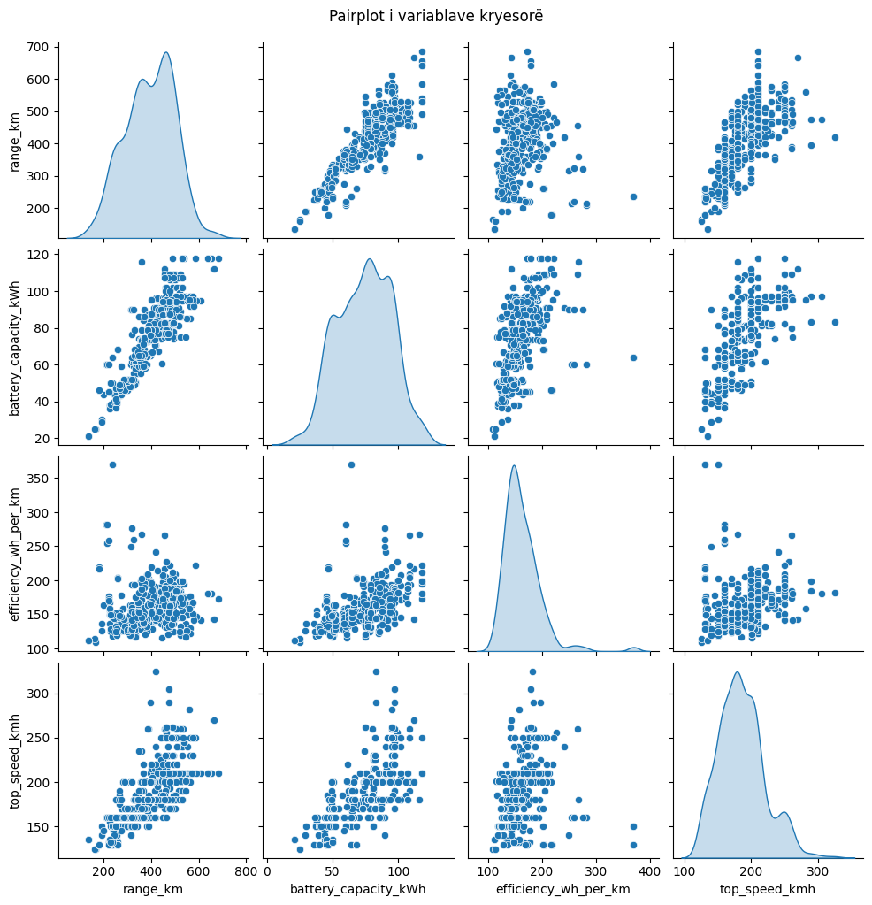
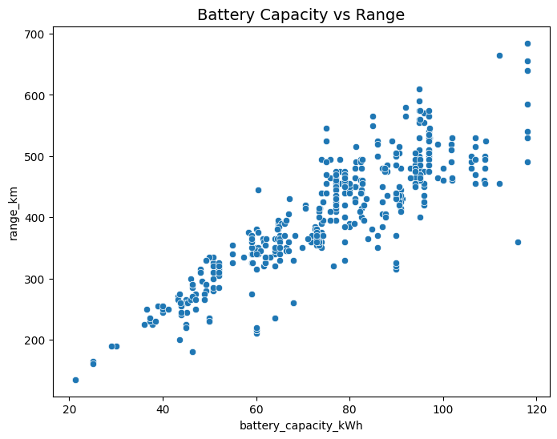
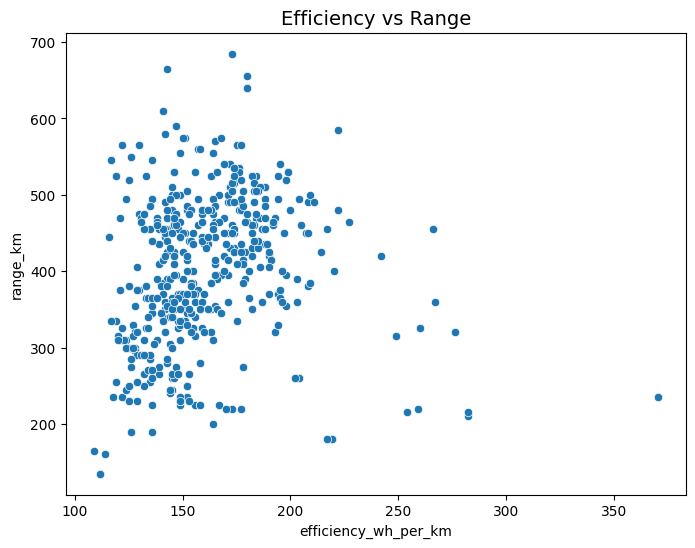
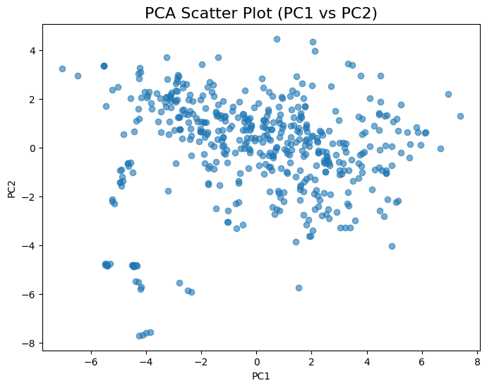

# Data Preparation and Visualization — Electric Vehicle Specifications  

### Introductory Information  
**University of Prishtina — Faculty of Computer and Software Engineering**  
**Master’s Program in Computer and Software Engineering**  
**Professor:** Dr.Sc. Mërgim Hoti  
**Group:** 9  

---

### Team Members  
- Rina Bunjaku
- Uranik Hodaj 

---

### Project Overview  
Performance and efficiency analysis of Electric Vehicles based on technical characteristics.
This project focuses on the **analysis and visualization of electric vehicle specifications** to identify structured specifications of electric vehicles (EVs), including brand, model, battery, charging, range, performance, and size metrics

---

### Dataset  

**Dataset:** Electric Vehicles Specifications Dataset  
**Source:**  — <a href="https://www.kaggle.com/datasets/urvishahir/electric-vehicle-specifications-dataset-2025?resource=download"> Kaggle</a>
---

### Project Setup  

```bash
# Create project directory
mkdir EV-Visualization
cd EV-Visualization

# Clone the repository
git clone https://github.com/bunjakurina/PVDH-G9.git
cd EV-Visualization

# Create and Activate a Virtual Environment
python -m venv venv
venv\Scripts\activate

# Install Dependencies
pip install -r requirements.txt

#Launch Jupyter Notebook
Option A — From VS Code

Install the Jupyter extension.

Open the .ipynb file.

Make sure the interpreter is set to your virtual environment (venv).

Option B — From Terminal
jupyter notebook
```

# Results - First Phase (Data pre-processing)

---

## Defining Data Types

- **Total rows:** 478  
- **Total columns:** 22  

### Categorical variables  
`brand`, `model`, `battery_type`, `fast_charge_port`, `cargo_volume_l`, `drivetrain`, `segment`, `car_body_type`, `source_url`

### Numerical variables  
`top_speed_kmh`, `battery_capacity_kWh`, `number_of_cells`, `torque_nm`, `efficiency_wh_per_km`, `range_km`, `acceleration_0_100_s`, `fast_charging_power_kw_dc`, `towing_capacity_kg`, `seats`, `length_mm`, `width_mm`, `height_mm`

---

## Data Cleaning

- **Columns removed (not relevant):**  
  `number_of_cells`, `length_mm`, `width_mm`, `height_mm`, `source_url`  
- **Columns with missing values:**  
  `model`, `torque_nm`, `fast_charging_power_kw_dc`, `fast_charge_port`, `towing_capacity_kg`, `cargo_volume_l`
- **Rows containing missing data:** 36  
- **Indices with NaN:** `[4, 5, 61, 100, 101, 102, ... 477]`
- After filling with mean/median/mode → **Total missing values:** `37 → 0`
- **Duplicated entries:** `0`
- **Invalid values (checked for extremes):** none outside realistic range  
  (e.g., no top speeds >400 km/h or battery capacities >200 kWh)

---

## Encoded Data (Label Encoding)

Categorical columns were encoded numerically.

| brand | model | top_speed_kmh | battery_capacity_kWh | torque_nm | efficiency_wh_per_km | range_km | drivetrain | car_body_type |
|-------|--------|----------------|----------------------|------------|----------------------|-----------|-------------|----------------|
| 0 | 46 | 155 | 37.8 | 235.0 | 156 | 225 | 1 | 2 |
| 1 | 396 | 150 | 60.0 | 310.0 | 156 | 315 | 1 | 4 |

**NaN values:** Reduced from `34 → 0` after encoding.  
**Duplicates:** `0` found.

---

## Aggregation & Summary Statistics

### Average Range by Car Body Type

| Car Body Type | Average Range (km) |
|----------------|-------------------:|
| Cabriolet | 316 |
| Coupe | 442.5 |
| Hatchback | 302.8 |
| Liftback Sedan | 488.2 |
| SUV | 396.5 |

### Average Battery Capacity by Drivetrain

| Drivetrain | Avg. Battery (kWh) |
|-------------|-------------------:|
| AWD | 88.58 |
| FWD | 55.50 |
| RWD | 74.93 |

### Average Efficiency (Wh/km) by Car Body Type

| Car Body Type | Avg. Efficiency (Wh/km) |
|----------------|-------------------------:|
| Cabriolet | 149.8 |
| Coupe | 187.0 |
| Hatchback | 133.5 |
| SUV | 161.5 |
| Sedan | 161.2 |
| Small Passenger Van | 212.4 |
| Station/Estate | 165.3 |

### Average Top Speed by Brand (sample)

| Brand | Avg. Top Speed (km/h) |
|--------|----------------------:|
| Abarth | 150 |
| Aiways | 160 |
| Audi | 230 |
| BMW | 250 |
| BYD | 180 |

### Models per Brand & Car Body Type (sample)

| Brand | Car Body Type | Num. Models |
|--------|----------------|-------------:|
| Audi | SUV | 6 |
| BMW | Sedan | 5 |
| Tesla | Liftback Sedan | 4 |
| BYD | SUV | 4 |
| Renault | Hatchback | 3 |

---

## Sampling

- **Total rows:** 478  
- **Simple sample (10%)** → 48 rows  
- **Fixed sample (100 rows)** created  
- **Stratified sample by Car Body Type (20%)** maintained proportional representation

Example of stratified distribution (approximate):  
SUV ≈ 52%, Sedan ≈ 14%, Hatchback ≈ 12%, etc.

---

## Feature Selection & Correlation

Highly correlated features were identified using a 0.7 threshold.  
Subset used for analysis:  
`battery_capacity_kWh`, `range_km`, `efficiency_wh_per_km`, `fast_charging_power_kw_dc`, `top_speed_kmh`

---

## Derived Features

New engineered attributes:

| Feature | Description |
|----------|--------------|
| `range_per_kWh` | Efficiency in km per kWh |
| `speed_efficiency_ratio` | Ratio of top speed to efficiency |
| `performance_index` | Top speed divided by acceleration time |
| `charge_rate_kw_per_kWh` | Fast charge rate relative to capacity |
| `eco_score` | Composite of range, efficiency, and acceleration |
| `range_category` | Categorized as Shkurt / Mesatar / Gjatë / Shumë Gjatë |

**Example:**

| brand | model | range_per_kWh | performance_index | eco_score | range_category |
|--------|--------|---------------|-------------------|-----------|----------------|
| Abarth | 500e Convertible | 5.95 | 22.14 | 3.30 | Shkurt |
| Abarth | 600e Turismo | 5.51 | 32.26 | 3.16 | Shkurt |
| Aiways | U5 | 5.25 | 20.00 | 2.94 | Mesatar |

---

## Discretization & Binarization

Battery capacity and range were discretized into 5 bins and binarized.

| Battery (kWh) | Battery Bin | Range (km) | Range Bin | Battery Bin. | Range Bin. |
|----------------|-------------|-------------|------------|----------------|-------------:|
| 37.8 | 1 | 225 | 1 | 1 | 1 |
| 60.0 | 2 | 315 | 2 | 1 | 1 |
| 88.5 | 3 | 440 | 3 | 1 | 1 |
| 110.0 | 4 | 520 | 4 | 1 | 1 |
| 150.0 | 5 | 720 | 5 | 1 | 1 |

---

## PCA (Principal Component Analysis)

- **Explained variance per component:**
  - PC1: 47.46%
  - PC2: 23.92%
  - PC3: 8.46%
  - PC4: 5.80%
- **Total variance retained:** 85.64%  

PCA reduced the dataset to **4 dimensions**, preserving most of the information.

---

## Standardization & Normalization

All numerical features were standardized (mean = 0, std = 1)  
and normalized (scaled between 0–1) for uniformity.

**Standardized Sample (first 5 rows):**
Values centered around zero, with similar variance.  

**Normalized Sample (first 5 rows):**
All features scaled between 0–1.

---

## Vehicle Distribution by Car Body Type

| Car Body Type | Proportion |
|----------------|------------:|
| SUV | 51.6% |
| Sedan | 13.7% |
| Hatchback | 11.6% |
| Small Passenger Van | 9.5% |
| Liftback Sedan | 7.4% |
| Station/Estate | 5.3% |
| Cabriolet | 1.1% |

---

## Top Performing Vehicles

| Brand | Model | Range (km) | Estimated Range | % Difference |
|--------|--------|------------|-----------------|--------------:|
| Zeekr | 001 Performance AWD | 480 | 591.19 | +23.17% |
| Audi | SQ6 e-tron Sportback | 495 | 578.66 | +16.90% |
| Ford | e-Tourneo Custom L2 160 kW | 235 | 172.97 | -26.39% |
| BYD | SEALION 7 82.5 kWh RWD Comfort | 415 | 482.46 | +16.25% |
| CUPRA | Tavascan Endurance | 445 | 542.25 | +21.85% |

---

## Summary

 Dataset cleaned and processed  
 Missing and duplicate values handled  
 Numerical and categorical features encoded  
 New analytical variables created (`eco_score`, `performance_index`, etc.)  
 Data standardized, normalized, and reduced via PCA  
 Aggregations reveal relationships between **drivetrain efficiency**, **battery capacity**, and **car body type**  
 Final dataset exported as `electric_vehicles_preproccesed.csv`

## Second Phase

## Outlier detection
Numri total i outliers: 25

----- OUTLIERS (Z-score dhe IQR) ----
             brand                         model  top_speed_kmh  \
89         Citroen        e-SpaceTourer M 50 kWh            130   
90         Citroen        e-SpaceTourer M 75 kWh            130   
91         Citroen       e-SpaceTourer XL 50 kWh            130   
92         Citroen       e-SpaceTourer XL 75 kWh            130   
98           Dacia            Spring Electric 45            125   
99           Dacia            Spring Electric 65            125   
194          Lucid             Air Grand Touring            270   
210       Maserati            GranCabrio Folgore            290   
211       Maserati           GranTurismo Folgore            325   
248  Mercedes-Benz                  EQT 200 Long            132   
283         Nissan      Townstar EV Passenger L2            130   
295           Opel       Zafira-e Life L2 50 kWh            130   
296           Opel       Zafira-e Life L2 75 kWh            130   
297           Opel       Zafira-e Life L3 50 kWh            130   
298           Opel       Zafira-e Life L3 75 kWh            130   
314        Peugeot         e-Traveller L2 50 kWh            130   
315        Peugeot         e-Traveller L2 75 kWh            130   
316        Peugeot         e-Traveller L3 50 kWh            130   
317        Peugeot         e-Traveller L3 75 kWh            130   
347        Porsche               Taycan Turbo GT            290   
348        Porsche      Taycan Turbo GT Weissach            305   
359        Renault  Kangoo Grand E-Tech Electric            130   
402          Tesla                 Model S Plaid            282   
408         Toyota         PROACE Verso L 75 kWh            130   
410         Toyota         PROACE Verso M 75 kWh            130   

     battery_capacity_kWh battery_type  number_of_cells  torque_nm  \
89                   46.3  Lithium-ion            216.0      220.0   
90                   68.0  Lithium-ion            324.0      220.0   
91                   46.3  Lithium-ion            216.0      220.0   
92                   68.0  Lithium-ion            324.0      220.0   
98                   25.0  Lithium-ion             72.0      125.0   
99                   25.0  Lithium-ion             72.0      113.0   
194                 112.0  Lithium-ion           6600.0     1200.0   
210                  83.0  Lithium-ion              NaN     1350.0   
211                  83.0  Lithium-ion              NaN     1350.0   
248                  45.0  Lithium-ion              NaN      245.0   
283                  45.0  Lithium-ion              NaN      245.0   
295                  46.3  Lithium-ion            216.0      270.0   
296                  68.0  Lithium-ion            324.0      270.0   
297                  46.3  Lithium-ion            216.0      270.0   
298                  68.0  Lithium-ion            324.0      260.0   
314                  46.3  Lithium-ion            216.0      270.0   
315                  68.0  Lithium-ion            324.0      270.0   
316                  46.3  Lithium-ion            216.0      270.0   
317                  68.0  Lithium-ion            324.0      270.0   
347                  97.0  Lithium-ion            396.0     1340.0   
348                  97.0  Lithium-ion            396.0     1340.0   
359                  45.0  Lithium-ion              NaN      245.0   
402                  95.0  Lithium-ion           7920.0        NaN   
408                  68.0  Lithium-ion            324.0      260.0   
410                  68.0  Lithium-ion            324.0      260.0   

     efficiency_wh_per_km  range_km  acceleration_0_100_s  ...  \
89                    217       180                  13.3  ...   
90                    202       260                  14.2  ...   
91                    219       180                  13.3  ...   
92                    204       260                  14.2  ...   
98                    109       165                  19.1  ...   
99                    114       160                  13.7  ...   
194                   143       665                   3.0  ...   
210                   198       395                   2.8  ...   
211                   182       420                   2.7  ...   
248                   177       220                  13.3  ...   
283                   173       220                  13.3  ...   
295                   217       180                  13.3  ...   
296                   202       260                  14.2  ...   
297                   219       180                  13.3  ...   
298                   204       260                  14.2  ...   
314                   217       180                  13.3  ...   
315                   202       260                  14.2  ...   
316                   219       180                  13.3  ...   
317                   204       260                  14.2  ...   
347                   184       475                   2.3  ...   
348                   180       475                   2.2  ...   
359                   170       220                  13.3  ...   
402                   158       560                   2.3  ...   
408                   204       260                  13.3  ...   
410                   202       260                  13.3  ...   

     towing_capacity_kg cargo_volume_l  seats drivetrain            segment  \
89               1000.0            603      9        FWD  N - Passenger Van   
90               1000.0            603      9        FWD  N - Passenger Van   
91               1000.0            989      9        FWD  N - Passenger Van   
92               1000.0            989      9        FWD  N - Passenger Van   
98                  0.0            308      4        FWD           A - Mini   
99                  0.0            308      4        FWD           A - Mini   
194                 0.0            456      5        AWD         F - Luxury   
210                 NaN            151      4        AWD         F - Luxury   
211                 NaN            270      4        AWD         F - Luxury   
248              1500.0            828      7        FWD  N - Passenger Van   
283              1500.0            819      7        FWD  N - Passenger Van   
295              1000.0            603      9        FWD  N - Passenger Van   
296              1000.0            603      9        FWD  N - Passenger Van   
297              1000.0            989      9        FWD  N - Passenger Van   
298              1000.0            989      9        FWD  N - Passenger Van   
314              1000.0            603      9        FWD  N - Passenger Van   
315              1000.0            603      9        FWD  N - Passenger Van   
316              1000.0            989      9        FWD  N - Passenger Van   
317              1000.0            989      9        FWD  N - Passenger Van   
347                 0.0            326      5        AWD         F - Luxury   
348                 0.0            367      2        AWD         F - Luxury   
359              1500.0            500      7        FWD  N - Passenger Van   
402              1600.0            709      5        AWD         F - Luxury   
408              1000.0            989      9        FWD  N - Passenger Van   
410              1000.0            603      9        FWD  N - Passenger Van   

    length_mm width_mm  height_mm        car_body_type  \
89       4983     1920       1890  Small Passenger Van   
90       4983     1920       1890  Small Passenger Van   
91       5333     1920       1890  Small Passenger Van   
92       5333     1920       1890  Small Passenger Van   
98       3700     1622       1516            Hatchback   
99       3700     1622       1516            Hatchback   
194      4975     1939       1410                Sedan   
210      4966     1957       1365            Cabriolet   
211      4959     1957       1353                Coupe   
248      4922     1859       1811  Small Passenger Van   
283      4911     1860       1815  Small Passenger Van   
295      4983     1920       1890  Small Passenger Van   
296      4983     1920       1890  Small Passenger Van   
297      5333     1920       1890  Small Passenger Van   
298      5333     1920       1890  Small Passenger Van   
314      4983     1920       1890  Small Passenger Van   
315      4983     1920       1890  Small Passenger Van   
316      5333     1920       1890  Small Passenger Van   
317      5333     1920       1890  Small Passenger Van   
347      4968     1966       1378                Sedan   
348      4968     1966       1378                Sedan   
359      4911     1860       1815  Small Passenger Van   
402      5021     1987       1431       Liftback Sedan   
408      5333     1920       1890  Small Passenger Van   
410      4983     1920       1890  Small Passenger Van   

## Avoiding false positives <br>
--- Mënjanimi i zbulimeve jo të sakta ---<br>
Totali i rreshtave fillestarë : 478<br>
Rreshta të identifikuar si Outliers (Z-score ∪ IQR): 25<br>
Rreshta të mbetur (Clean Data): 453<br>
Përqindja e të dhënave të humbura: 5.23%<br>
<br>
Outliers të ruajtur në dataset/z_iqr_removed_outliers.csv<br>
<br>
--- PARA HEQJES ---<br>
      top_speed_kmh  battery_capacity_kWh    range_km  acceleration_0_100_s<br>
mean     185.487448             74.043724  393.179916              6.882636<br>
std       34.252773             20.331058  103.287335              2.730696<br>
min      125.000000             21.300000  135.000000              2.200000<br>
max      325.000000            118.000000  685.000000             19.100000<br>
<br>
--- PAS HEQJES ---<br>
      top_speed_kmh  battery_capacity_kWh    range_km  acceleration_0_100_s<br>
mean     186.399558             74.655850  399.128035              6.645254<br>
std       30.763682             20.047133   98.055549              2.327283<br>
min      130.000000             21.300000  135.000000              2.400000<br>
max      262.000000            118.000000  685.000000             12.900000 <br>
=== Isolation Forest: Detektimi i anomalive ===<br>

Numri i anomalive (Isolation Forest): 22<br>
## Data mining: summary statistics, multivariate. <br>
=== Informata bazë ===
RangeIndex: 478 entries, 0 to 477
Data columns (total 29 columns):
 #   Column                      Non-Null Count  Dtype   
---  ------                      --------------  -----   
 0   brand                       478 non-null    object  
 1   model                       477 non-null    object  
 2   top_speed_kmh               478 non-null    int64   
 3   battery_capacity_kWh        478 non-null    float64 
 4   battery_type                478 non-null    object  
 5   torque_nm                   471 non-null    float64 
 6   efficiency_wh_per_km        478 non-null    int64   
 7   range_km                    478 non-null    int64   
 8   acceleration_0_100_s        478 non-null    float64 
 9   fast_charging_power_kw_dc   477 non-null    float64 
 10  fast_charge_port            477 non-null    object  
 11  towing_capacity_kg          452 non-null    float64 
 12  cargo_volume_l              477 non-null    object  
 13  seats                       478 non-null    int64   
 14  drivetrain                  478 non-null    object  
 15  segment                     478 non-null    object  
 16  car_body_type               478 non-null    object  
 17  estimated_range             478 non-null    float64 
...
memory usage: 105.4+ KB
None

=== Statistika numerike përmbledhëse ===
Output is truncated. View as a scrollable element or open in a text editor. Adjust cell output settings...
top_speed_kmh	battery_capacity_kWh	torque_nm	efficiency_wh_per_km	range_km	acceleration_0_100_s	fast_charging_power_kw_dc	towing_capacity_kg	seats	estimated_range	range_diff_pct	range_per_kWh	speed_efficiency_ratio	performance_index	charge_rate_kw_per_kWh	eco_score	battery_capacity_binned	range_binned	battery_capacity_binarized	range_binarized
count	478.000000	478.000000	471.000000	478.000000	478.000000	478.000000	477.000000	452.000000	478.000000	478.000000	478.000000	478.000000	478.000000	478.000000	477.000000	478.000000	478.000000	478.000000	478.0	478.0
mean	185.487448	74.043724	498.012739	162.903766	393.179916	6.882636	125.008386	1052.261062	5.263598	458.987221	18.768247	5.380204	1.167394	33.567841	1.653048	3.074282	2.192469	1.866109	1.0	1.0
std	34.252773	20.331058	241.461128	34.317532	103.287335	2.730696	58.205012	737.851774	1.003961	111.994832	9.728445	0.714469	0.230151	20.539917	0.481704	0.405482	0.992945	0.992034	0.0	0.0
min	125.000000	21.300000	113.000000	109.000000	135.000000	2.200000	29.000000	0.000000	2.000000	172.972973	0.078678	3.103448	0.351351	6.544503	0.546875	1.796525	0.000000	0.000000	1.0	1.0
25%	160.000000	60.000000	305.000000	143.000000	320.000000	4.800000	80.000000	500.000000	5.000000	389.610350	11.866723	4.944088	1.077476	19.753086	1.355932	2.846439	2.000000	1.000000	1.0	1.0
50%	180.000000	76.150000	430.000000	155.000000	397.500000	6.600000	113.000000	1000.000000	5.000000	463.624313	18.939146	5.430472	1.181211	29.008883	1.562500	3.117786	2.000000	2.000000	1.0	1.0
75%	201.000000	90.600000	679.000000	177.750000	470.000000	8.200000	150.000000	1600.000000	5.000000	536.222928	25.656337	5.905512	1.279549	41.968750	1.796247	3.356873	3.000000	3.000000	1.0	1.0
max	325.000000	118.000000	1350.000000	370.000000	685.000000	19.100000	281.000000	2500.000000	9.000000	783.216783	45.900204	7.355372	1.888112	138.636364	3.380282	4.230300	4.000000	4.000000	1.0	1.0
<Figure size 1400x1200 with 0 Axes>


=== Skewness (asimetria e shpërndarjes) ===
top_speed_kmh                 0.645003
battery_capacity_kWh         -0.106333
torque_nm                     0.834466
efficiency_wh_per_km          2.409480
range_km                     -0.155623
acceleration_0_100_s          0.880119
fast_charging_power_kw_dc     1.042050
towing_capacity_kg           -0.095611
seats                         1.999372
estimated_range              -0.255472
range_diff_pct                0.081875
range_per_kWh                -0.447060
speed_efficiency_ratio       -0.458491
performance_index             1.784634
charge_rate_kw_per_kWh        1.035451
eco_score                    -0.658332
battery_capacity_binned      -0.148290
range_binned                 -0.155894
battery_capacity_binarized    0.000000
range_binarized               0.000000
dtype: float64
C:\Users\ThinkPad\AppData\Local\Temp\ipykernel_18588\1115238447.py:29: FutureWarning: 

Passing `palette` without assigning `hue` is deprecated and will be removed in v0.14.0. Assign the `x` variable to `hue` and set `legend=False` for the same effect.

  sns.barplot(x=skew_vals.index, y=skew_vals.values, palette="coolwarm")


=== Kurtosis (peshat e shpërndarjes) ===
top_speed_kmh                  0.529676
battery_capacity_kWh          -0.618342
torque_nm                      0.304018
efficiency_wh_per_km          10.621747
range_km                      -0.486618
acceleration_0_100_s           0.745237
fast_charging_power_kw_dc      0.600633
towing_capacity_kg            -1.105855
seats                          5.494194
estimated_range               -0.172215
range_diff_pct                -0.318373
range_per_kWh                  0.067954
speed_efficiency_ratio         1.726490
performance_index              4.325028
charge_rate_kw_per_kWh         0.901253
eco_score                      0.622194
battery_capacity_binned       -0.520723
range_binned                  -0.667759
battery_capacity_binarized     0.000000
range_binarized                0.000000
dtype: float64






=== Varianca e shpjeguar nga PCA ===
[0.47457442 0.23922062]

 
## Third Phase


